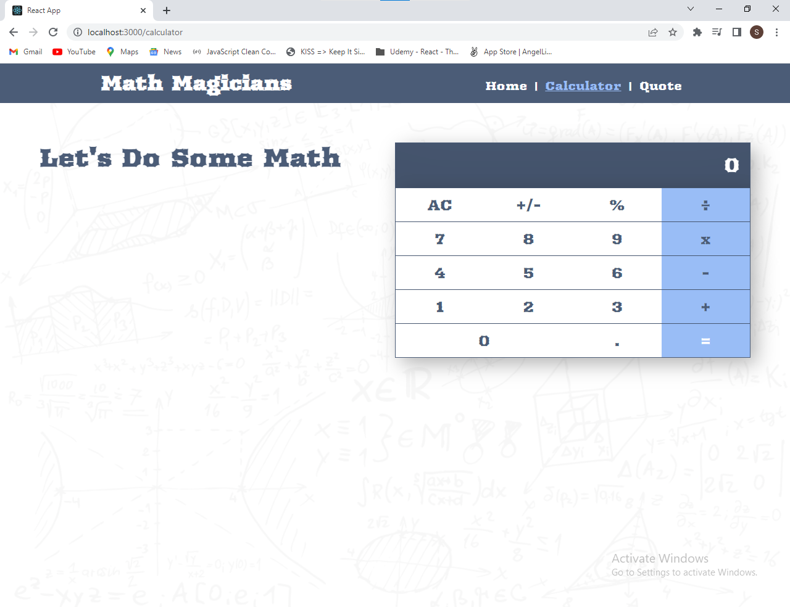

# Math Magicians

## Additional description about the project and its features:
This is simple react based calculator project.

## Built With

- React.js
- HTML and CSS
- JavaScript
- [HTML & CSS3 & JavaScript Linters](https://github.com/microverseinc/linters-config/tree/master/html-css-js)
- Github and GithubFlow
- Webpack

## App Screenshot

## Getting Started

**To create a Calculator from this Repository feel free to contact me.**

## How to run in your local machine

- Copy the URL: git@github.com:Saadat123456/Math-Magicians.git
- In your terminal, go to the directory you want to clone the repository.
- Use the command: git clone git@github.com:Saadat123456/Math-Magicians.git
- Run npm install in the terminal to install node modules
- Execute npm run build in terminal to build the development files
- To start a server run npm start and the server would be started on port 8080

## Authors

👤 **Saadat Ali**

- GitHub: [@Saadat123456](https://github.com/Saadat123456)

## 🤝 Contributing

Contributions, issues, and feature requests are welcome!

Feel free to check the [issues page](../../issues/).

## Show your support

Give a ⭐️ if you like this project!

## Acknowledgments

- Microverse Team

## 📝 License

This project is [MIT](./LICENSE) licensed.

